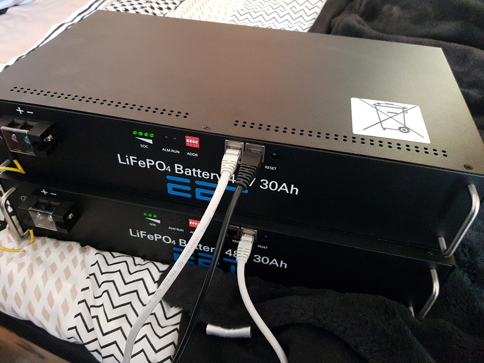

# Topband/EET battery communication

Software/API to communicate with these things:

- commands/encode/decode in [topband.h](topband.h)
- print commands (along with unit conversions) in [topband_print.h](topband_print.h)

Absolutely no guarantee that anything works or won't blow up your battery. This is a reverse-engineered effort. Use at your own risk!
